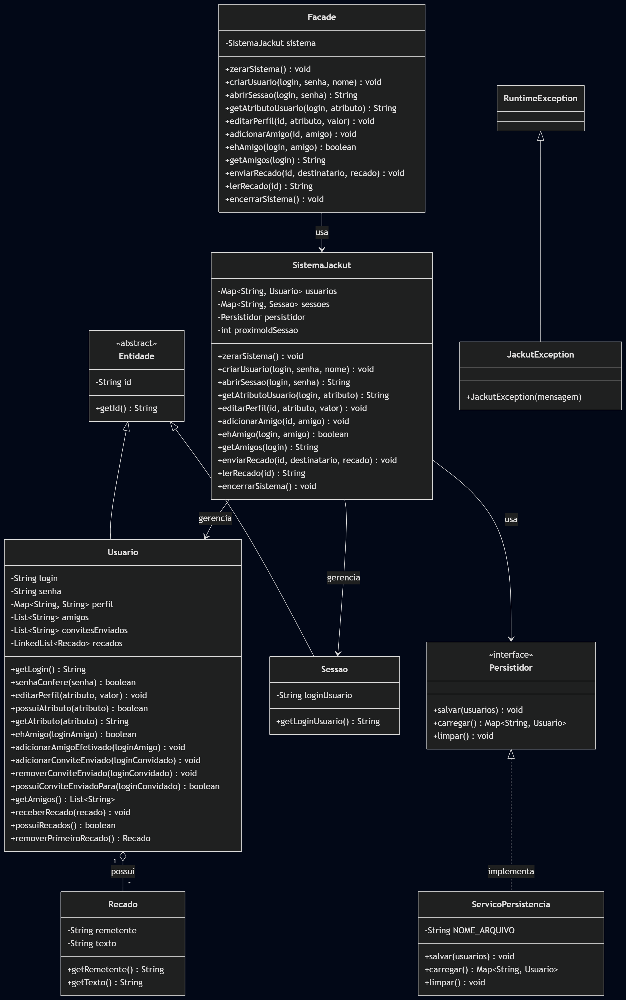

# Jackut

Projeto desenvolvido em **Java** para a disciplina de **Programação 2**, com aplicação de conceitos de **Programação Orientada a Objetos**, contemplando a implementação do **Milestone 01** do projeto **Jackut**.

## Objetivo

Implementar as funcionalidades principais do sistema Jackut, uma rede de relacionamentos inspirada no Orkut, respeitando os requisitos definidos para o primeiro marco do projeto e garantindo compatibilidade com os testes de aceitação fornecidos.

## Conceitos aplicados

Durante o desenvolvimento do projeto, foram aplicados os principais conceitos estudados na disciplina, entre eles:

* Classes e objetos
* Construtores
* Encapsulamento
* Herança
* Classes abstratas
* Composição
* Listas
* Exceções
* Interfaces
* Persistência em arquivo
* Separação de responsabilidades
* Padrão Facade

## Funcionalidades implementadas

### Milestone 01

* Cadastro de usuários
* Login por abertura de sessão
* Consulta de atributos de usuários
* Criação e edição de perfil
* Envio de convites de amizade
* Efetivação de amizade por aceitação recíproca
* Verificação de amizade entre usuários
* Listagem de amigos
* Envio de recados entre usuários
* Leitura de recados em ordem de recebimento
* Persistência em arquivo

## Estrutura do projeto

* `src`: código-fonte do sistema
* `modelos`: entidades principais do domínio
* `servicos`: classes responsáveis pelas regras de negócio e persistência
* `contratos`: interfaces utilizadas pelo sistema
* `excecoes`: exceção personalizada para regras de negócio
* `Facade`: classe principal utilizada pelos testes
* `Main`: classe de execução dos testes com EasyAccept
* `tests`: arquivos de teste de aceitação
* `lib`: biblioteca `easyaccept.jar`
* `relatorio`: relatório do projeto e diagrama de classes

## Organização dos pacotes

O projeto foi organizado nos seguintes pacotes principais:

* `br.ufal.ic.p2.jackut`: contém a classe `Facade`
* `br.ufal.ic.p2.jackut.modelos`: contém as entidades do domínio, como `Usuario`, `Sessao`, `Recado` e `Entidade`
* `br.ufal.ic.p2.jackut.servicos`: contém a lógica de negócio e a persistência, com `SistemaJackut` e `ServicoPersistencia`
* `br.ufal.ic.p2.jackut.contratos`: contém a interface `Persistidor`
* `br.ufal.ic.p2.jackut.excecoes`: contém a exceção personalizada `JackutException`

## Arquitetura

A arquitetura do projeto foi organizada com separação de responsabilidades entre a fachada, a lógica de negócio, os modelos, os contratos, as exceções e a persistência.

A classe `Facade` funciona como ponto de entrada para os testes do EasyAccept, delegando as operações para `SistemaJackut`.

A classe `SistemaJackut` concentra as regras de negócio do Milestone 01, incluindo usuários, sessões, perfis, amizades, convites e recados.

As classes do pacote `modelos` representam as entidades principais do domínio. A classe abstrata `Entidade` é herdada por `Usuario` e `Sessao`.

A persistência foi isolada por meio da interface `Persistidor`, implementada pela classe `ServicoPersistencia`.

## Diagrama de classes

O diagrama de classes do projeto está disponível na pasta:

* `relatorio/diagrama-classes.png`



## Documentação do código

O código-fonte foi documentado com **Javadoc**, incluindo descrições de pacotes, classes, métodos, parâmetros, retornos e exceções principais do sistema.

Foram adicionados arquivos `package-info.java` nos pacotes principais para documentar a organização do projeto.

## Testes implementados

O projeto está compatível com os testes de aceitação do **Milestone 01**:

* `us1_1`
* `us1_2`
* `us2_1`
* `us2_2`
* `us3_1`
* `us3_2`
* `us4_1`
* `us4_2`

Os testes foram executados com sucesso, totalizando **184 testes OK**.

## Como executar

1. Abra o projeto no IntelliJ IDEA
2. Certifique-se de que a pasta `src` está marcada como **Sources Root**
3. Verifique se o arquivo `easyaccept.jar` está corretamente adicionado ao projeto
4. Configure a execução com a codificação `ISO-8859-1`
5. Execute a classe `Main.java` para rodar os testes de aceitação

VM options recomendadas:

```txt
-Dfile.encoding=ISO-8859-1 -Dsun.stdout.encoding=ISO-8859-1 -Dsun.stderr.encoding=ISO-8859-1
```

## Relatório

O relatório do projeto está disponível na pasta:

* `relatorio/relatorio-milestone1.pdf`

O relatório apresenta a descrição do design arquitetural, os principais componentes do sistema, as interações entre as classes, os conceitos de Programação Orientada a Objetos aplicados, o padrão de projeto utilizado, a persistência de dados e os testes executados.

## Observação

O projeto foi implementado de forma compatível com os testes do EasyAccept disponibilizados para o **Milestone 01** do projeto **Jackut**.

A implementação utiliza apenas caminhos relativos, evitando dependência de caminhos absolutos da máquina de desenvolvimento.
